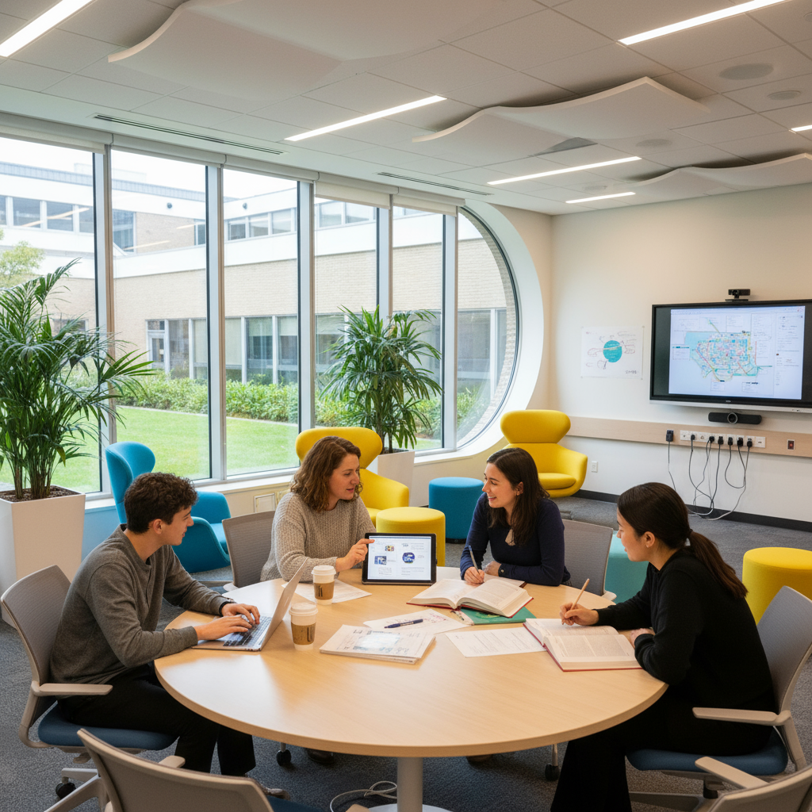

---
hide:
  - navigation
  - toc
level: secret
---

    

# Monitor

Documentação do projeto ** Gestão de Monitoria**.

## Visão Geral

O App Monitor é uma aplicação para acompanhar o Ciclo de vida do Monitor e Tech Assist. Ele permite gerenciar etapas.

## Responsáveis

O projeto é desenvolvido no âmbito dos Projetos de Extensão dos cursos de Tecnologia do Ibmec/RJ, sob a coordenação do Prof. Thiago Souza. A orientação e organização são realizadas pelo Prof. Jonh Carvalho, nas disciplinas de Projeto Front-End e Projeto Back-End. A concepção e definição de requisitos contam com a participação de Leci Lima (Coordenadora da Casa) e Rebeca Alves (Suporte ao Aluno da Casa).

Participação das Turmas:

- PFE 25.2 8003 - Centro
- PFE 25.2 8002 - Barra
- PBE 25.2 8003 - Centro
- PBE 25.2 8004 - Barra
- PBE 25.2 8001 - Barra

## Tecnologias Utilizadas

- **Frontend:** React.js
- **Backend:** Python, Django
- **Banco de Dados:** Sqlite, MySQL
- **Hospedagem:** xxx
